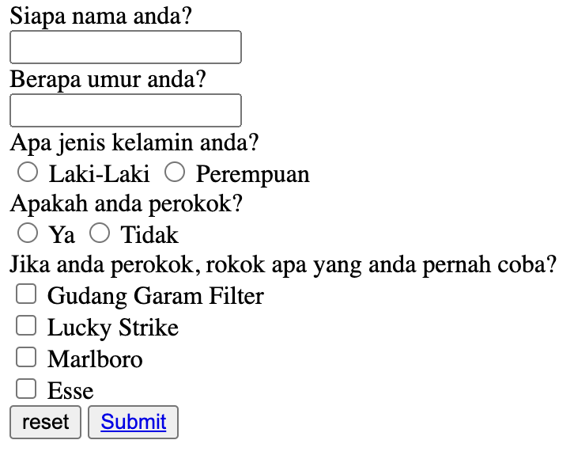

## Survey form project example using HTML

This repository contains a simple HTML project to create a survey form about smoking habits. The main focus of this project is to document the basic HTML structure to support further development. In addition, this project aims to collect data on the number of smokers, their ages, and analyze the average age range among smokers.

## Preview



## How to Run this project

1. Clone this project
```
git clone https://github.com/Dwaysetya/fgo24-html-formsurvey
```
2. Enter the project firectory
```
cd directory-name
```
3. Install the Depedencies
```
npm install
```
4. run the project
```
npm run dev
```
5. Project will running on http://localhost:8080

## Depedencies

This project requires Node.js to run, so make sure Node.js is installed on your device.
- live-server: used to document an HTTP server locally, easing the development and testing process.

## Basic Information

This project was developed as part of the learning program at Kodacademy Bootcamp Batch 24, which was carried out by Dwi Setyabudi in order to deepen the understanding and technical skills acquired during the training.